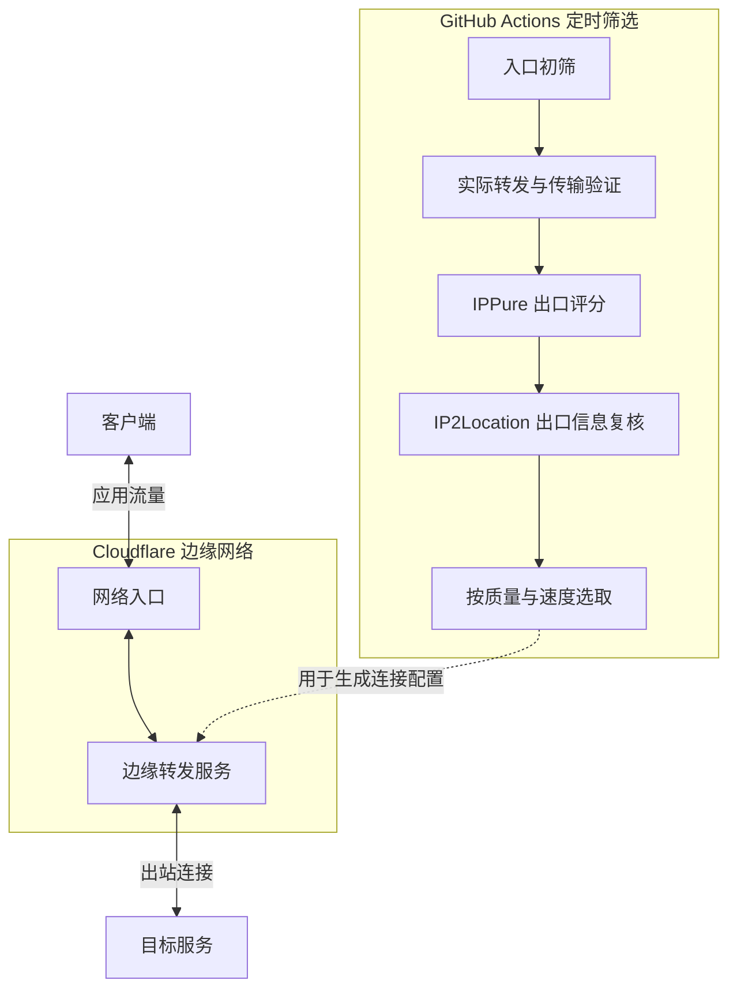

# Cloudflare 入口 IP 定时筛选

每天两次检查 Cloudflare 候选入口，验证实际转发、评估出口风险并复核出口信息，保留最多 9 个连接地址。

本项目使用 IP2Location.io [IP geolocation](https://www.ip2location.io) web service 复核出口信息。

客户端连接 Cloudflare 入口后，由部署在边缘的转发服务建立到目标服务的出站连接，并将响应传回客户端。图中省略了具体协议、认证和可选的中间转发环节。

本仓库负责图中的定时检查与入口筛选。GitHub 不承载应用流量；筛选结果供转发服务生成连接配置时引用。

## 自动筛选

GitHub Actions 按北京时间每天 **09:15、21:15** 运行，无需本地设备持续开机；实际启动时间可能因 GitHub 排队而延后。

筛选按以下顺序进行：

1. **入口初筛**：使用 [CFData-WEB](https://github.com/PoemMisty/CFData-WEB) 对 Cloudflare 官方 IPv4 网段抽样，再重复检查 HTTPS 连通性。
2. **实际转发验证**：使用 [sing-box](https://github.com/SagerNet/sing-box) 建立经过认证的转发连接，完成三轮基准请求及 YouTube、X 页面访问。
3. **传输检查**：下载目标页面资源，再进行短时持续传输，检查数据完整性和传输表现。
4. **出口评分**：通过每个合格节点调用 [IPPure](https://ippure.com/MyIP-Info-API)，记录该次请求的出口 IP、地区和风险系数。
5. **出口复核**：使用 IP2Location.io 免密钥 API 查询 IPPure 已测到的同一个出口，比较国家与 ASN，并记录基础公开代理检测结果。每轮按出口去重，同一出口只查询一次。
6. **排序与选取**：已取得评分的节点优先，按出口质量分从高到低排序；同分时比较实际转发响应和下载速度。质量分为 `100 − IPPure 风险系数`，分数越高表示该服务报告的出口风险越低。

连接失败、TLS 异常、返回拦截页面或传输检查未通过的候选都会被淘汰。仅凭入口延迟，无法确认实际转发是否可用。

目标是保留最多 9 个入口，按 GitHub 测试机器的结果统一筛选，不设国家配额。IPPure 超时、返回异常或缺少有效评分时，节点标为质量未知，仍可按实际转发表现补齐。合格数量不足时只保留实际数量，没有合格结果时保留上次有效内容。

IP2Location.io 无需注册或 API Key，免密钥接口每天最多 1,000 次查询。查询间隔至少一秒；接口异常或额度用尽时标为复核未知，地区或 ASN 不一致时记录差异。这些结果只辅助观察，不修改质量分或淘汰已通过实际转发检查的节点。

筛选结果通过固定地址更新。节点采用固定序号名称 `CF-01` 至 `CF-09`；每轮更新对应的入口地址，评分变化不会改变名称。名称表示当前排序位置，同名节点不保证一直对应同一个 IP。客户端仍需更新订阅才能获取新地址，可通过自动更新和固定策略组减少手动操作。

## 结果的适用范围

入口机房信息只用于检测记录，不参与国家分配或节点命名。由于 Anycast 路由随访问地点变化，同一个入口在不同网络下可能连接到不同机房，云端排序也不代表本地线路的表现。

出口质量分和查询状态保存在 `status.json` 中，不再写入节点名称。IPPure 的评分包含历史风险记录与推断，不是各目标网站的官方评分；接口仍处于测试阶段。访问 IPPure 时的出口也可能与访问其他网站时不同，因此高分不能保证 AI 服务可用，也不保证出口始终不变。

IP2Location.io 免费接口用于定位与基础公开代理检测，不提供风险分。`is_proxy` 为否不代表没有使用 VPN 或其他代理；两家的地区、ASN 判断也可能因数据库更新而不同。[接口文档](https://www.ip2location.io/ip2location-documentation) · [套餐与额度](https://www.ip2location.io/pricing)

检查覆盖入口、真实转发请求与有限时长的传输，页面检测不代表视频播放、登录、AI 地区资格或全天稳定性。入口地区与最终出口地区是两个独立概念，实际使用效果仍需在客户端验证。

2026-10-08，使用者已在 iOS 和 macOS 上完成订阅更新并确认节点可用，反馈使用效果比此前有所改善。这次验证针对当时的节点与使用线路，后续批次仍需以实际连接表现为准。

仓库只保存候选入口和检测结果。测试所需认证配置保存在 GitHub Secrets，公开结果不包含认证信息。
