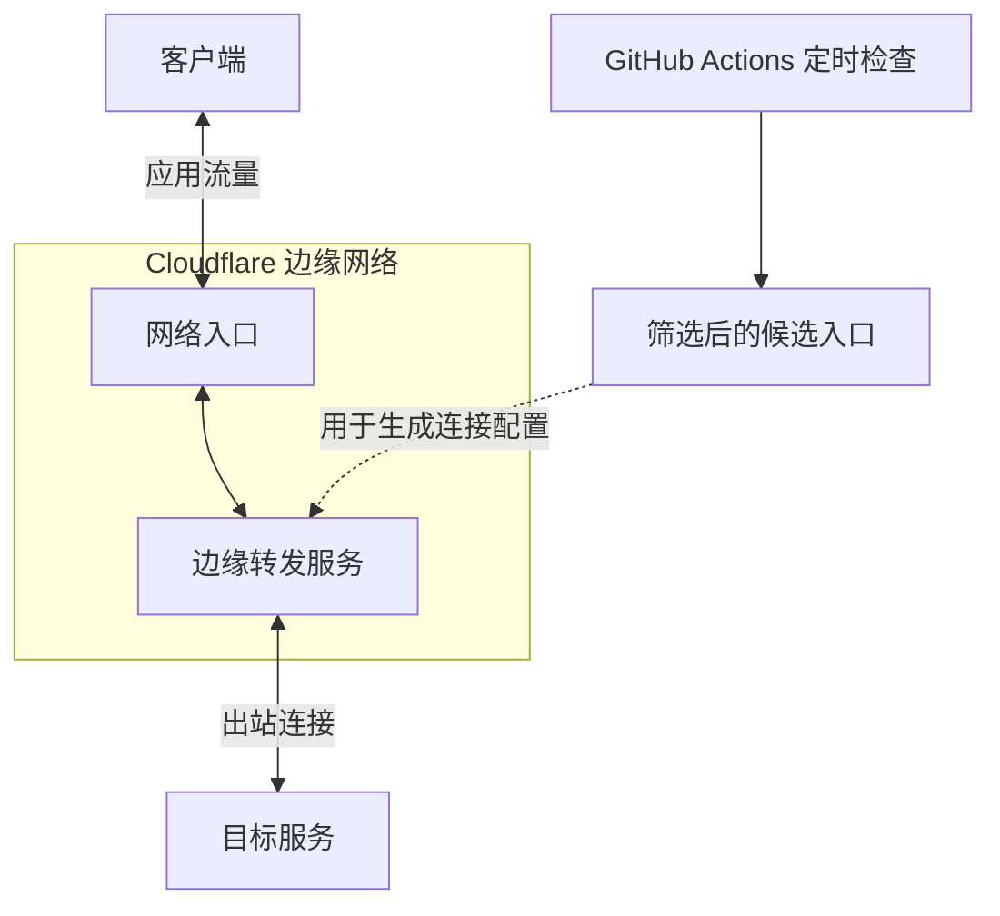

# Cloudflare 入口 IP 定时筛选

定期检查 Cloudflare 候选入口，为边缘转发服务提供可更新的连接地址。

客户端连接 Cloudflare 入口后，由部署在边缘的转发服务建立到目标服务的出站连接，并将响应传回客户端。图中省略了具体协议、认证和可选的中间转发环节。

本仓库负责图中的定时检查与入口筛选。GitHub 不承载应用流量；筛选结果供转发服务生成连接配置时引用。

## 自动筛选

GitHub Actions 按北京时间每天 **09:15、21:15** 运行，无需本地设备持续开机；实际启动时间可能因 GitHub 排队而延后。

筛选按以下顺序进行：

1. **入口初筛**：使用 [CFData-WEB](https://github.com/PoemMisty/CFData-WEB) 对 Cloudflare 官方 IPv4 网段抽样，再重复检查 HTTPS 连通性。
2. **实际转发验证**：使用 [sing-box](https://github.com/SagerNet/sing-box) 建立经过认证的转发连接，完成三轮基准请求及 YouTube、X 页面访问。
3. **传输检查**：下载目标页面资源，再进行短时持续传输，检查数据完整性和传输表现。
4. **排序与分配**：只保留通过全部检查的候选，优先按实际转发响应排序，再参考下载速度。

连接失败、TLS 异常、返回拦截页面或传输检查未通过的候选都会被淘汰。仅凭入口延迟，无法确认实际转发是否可用。

目标是保留最多 9 个入口，新加坡、日本、美国各 3 个。新加坡或日本候选不足时，由美国候选补齐；没有亚洲候选时使用美国候选。合格数量仍不足时只保留实际数量，没有合格结果时保留上次有效内容。

筛选结果通过固定地址更新，客户端刷新订阅即可获取最新内容，无需每次替换来源地址。

## 结果的适用范围

地区标记来自检测时实际连接到的 Cloudflare 数据中心。由于 Anycast 路由随访问地点变化，同一个入口在不同网络下可能连接到不同机房，云端排序也不代表本地线路的表现。

检查覆盖入口、真实转发请求与有限时长的传输，页面检测不代表视频播放、登录、AI 地区资格或全天稳定性。入口地区与最终出口地区是两个独立概念，实际使用效果仍需在客户端验证。

2026-10-08，使用者已在 iOS 和 macOS 上完成订阅更新并确认节点可用，反馈使用效果比此前有所改善。这次验证针对当时的节点与使用线路，后续批次仍需以实际连接表现为准。

仓库只保存候选入口和检测结果。测试所需认证配置保存在 GitHub Secrets，公开结果不包含认证信息。
